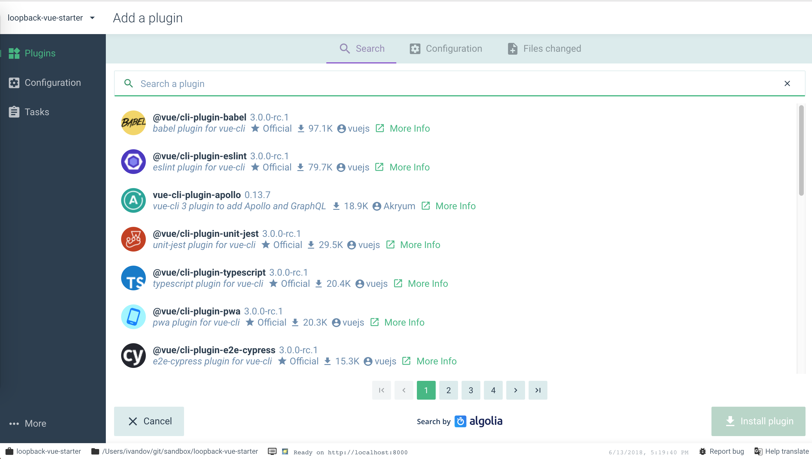

# LoopBack Vue Starter
This project is a starter template for integrating [LoopBack v3.x](http://loopback.io/doc/en/lb3/) and [Vue.JS v2.0](https://vuejs.org/).

This project was built with [vue-cli](https://cli.vuejs.org/) and therefore can use the `vue ui` command to manage Vue plugins.


### Getting Started
The starter template has a very minimal set of features pre-enabled, currently only nodemon and vue-router. 

To run the LoopBack server and Vue frontend in development mode (with active reload) run:
```
npm run dev
```

To build the application for distribution and run the LoopBack server in production mode, run: 
```
npm run prod
```


### Enabling Additional Vue Plugins
Additional Vue plugins can be managed via the [vue-cli](https://cli.vuejs.org/) or using [vue ui](https://cli.vuejs.org/guide/creating-a-project.html#using-the-gui). Just import the root directory as an existing project and manage plugins as necessary.

The vue-router plugin is auto-enabled since it is not easy to add it as a plugin through the UI / cli, and quite easy to remove/ignore if not used. 

